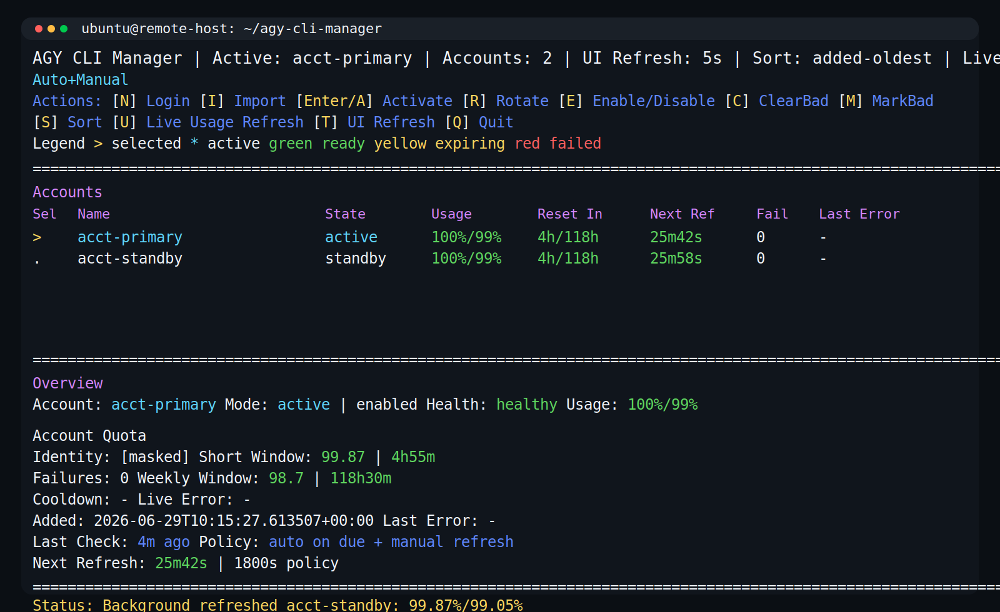

# agy-cli-manager

`agy-cli-manager` is an active-standby account manager for Antigravity CLI (`agy`).

It is designed for one active account at a time:

- keep multiple saved `agy` profiles
- switch the active profile explicitly or after failure
- expose machine-readable state for external callers
- stay usable as a CLI app, TUI dashboard, or Python library

It is application-agnostic. A Telegram bot can call it, but the manager itself is not Telegram-specific.



## What it does

- stores multiple account profiles safely
- keeps one account active while others stay standby/cooldown/disabled
- supports isolated interactive `agy` login
- can import an existing `~/.gemini` or similar live home
- tracks cached identity, health, and usage metadata
- exposes CLI commands and JSON output for automation
- supports account failover with cooldowns and lock-protected state changes

## Requirements

- Python 3.10+
- a working `agy` binary available in `PATH`, or passed explicitly with `--agy-binary`
- a terminal if you want to use `login` or the full-screen dashboard

## Install

From this repo:

```bash
cd agy-cli-manager
python3 -m venv .venv
. .venv/bin/activate
pip install -e .
```

After that, you can use either:

```bash
agy-cli-manager --help
```

or:

```bash
PYTHONPATH=src python3 -m agy_cli_manager.cli --help
```

## Quick Start

### 1. Initialize the manager state

```bash
agy-cli-manager init
```

By default, state lives under:

```text
~/.agy-cli-manager
```

You can override that with `--root /path/to/root`.

### 2. Add your first account

If you already have a live Antigravity home:

```bash
agy-cli-manager import-current my-account ~/.gemini
```

If you want the manager to drive a fresh interactive login itself:

```bash
agy-cli-manager login my-account --agy-binary /path/to/agy
```

`login` will hand your terminal to a real `agy` session. Complete the normal Antigravity onboarding/login there, then exit `agy`. The manager will save the resulting profile snapshot.

### 3. Check what is active

```bash
agy-cli-manager status
agy-cli-manager current
agy-cli-manager list
```

### 4. Open the dashboard

```bash
agy-cli-manager
```

With no subcommand, the full-screen dashboard opens by default.

## First Useful Commands

```bash
agy-cli-manager status --json
agy-cli-manager whoami
agy-cli-manager models --json
agy-cli-manager refresh-usage --json
agy-cli-manager switch-next
agy-cli-manager rotate-after-failure --reason quota --cooldown-minutes 60 --json
```

Directory layout:

```text
~/.agy-cli-manager/
├── accounts/
│   └── <account-name>/
│       ├── .gemini/
│       │   └── ...
│       ├── .config/
│       │   └── ...
│       ├── .cache/
│       │   └── ...
│       └── .local/
│           └── ...
├── runtime/
│   ├── .gemini/
│   ├── .config/
│   ├── .cache/
│   └── .local/
└── state.json
```

Optional integration:

- `live_dir` can point at a real Antigravity/Gemini CLI home such as `~/.gemini`
- when set, switches sync the managed CLI home snapshot into that runtime home and clear token cache there too

Example:

```bash
agy-cli-manager set-live-dir ~/.gemini
agy-cli-manager apply-active
```

This is useful when another process launches `agy` and you want that live home to always reflect the currently active saved profile.

Commands:

```bash
agy-cli-manager
agy-cli-manager dashboard
agy-cli-manager menu
agy-cli-manager init
agy-cli-manager list
agy-cli-manager current
agy-cli-manager status
agy-cli-manager status --json
agy-cli-manager refresh-usage
agy-cli-manager refresh-usage account1 --json
agy-cli-manager refresh-due
agy-cli-manager refresh-due --json
agy-cli-manager models
agy-cli-manager models --json
agy-cli-manager models account1 --json
agy-cli-manager whoami
agy-cli-manager whoami account1 --refresh
agy-cli-manager whoami account1 --probe-usage --agy-binary /path/to/agy
agy-cli-manager add account1 /path/to/source
agy-cli-manager import-current account1
agy-cli-manager import-current account1 /path/to/.gemini
agy-cli-manager login
agy-cli-manager login account1 --agy-binary /path/to/agy
agy-cli-manager activate account1
agy-cli-manager switch account1
agy-cli-manager rotate
agy-cli-manager switch-next
agy-cli-manager disable account1
agy-cli-manager enable account1
agy-cli-manager mark-bad account1 --reason quota --cooldown-minutes 60
agy-cli-manager clear-bad account1
agy-cli-manager set-live-dir ~/.gemini
agy-cli-manager apply-active
agy-cli-manager rotate-after-failure --reason quota --cooldown-minutes 60 --json
agy-cli-manager update-meta account1 --usage-status known --usage-value 42 --reset-at 2026-07-01T00:00:00+00:00 --health-status healthy --last-live-check-at 2026-06-30T06:00:00+00:00 --next-live-check-at 2026-06-30T06:30:00+00:00 --refresh-policy-seconds 1800
agy-cli-manager update-meta account1 --short-usage-status known --short-usage-value 97.57 --short-reset-at 2026-07-01T00:00:00+00:00 --weekly-usage-status unknown
```

`add` accepts either:

- a directory that is already a `.gemini` profile root
- or a parent directory containing `.gemini/`

## JSON/API-oriented usage

For automation, prefer the JSON-capable commands:

```bash
agy-cli-manager status --json
agy-cli-manager current --json
agy-cli-manager list --json
agy-cli-manager refresh-usage account1 --json
agy-cli-manager refresh-due --json
agy-cli-manager models --json
agy-cli-manager rotate-after-failure --reason quota --cooldown-minutes 60 --json
```

Typical external-app flow:

1. read current state with `status --json`
2. use `models --json` if the caller needs model choices for the active account
3. call `refresh-usage --json` or `refresh-due --json` only when needed
4. if a real request fails due to auth/quota, call `rotate-after-failure --json`
5. persist caller-side observations back with `update-meta`

Notes:

- running `agy-cli-manager` with no subcommand opens the full-screen dashboard
- `dashboard` is a TTY-only full-screen view with a fast local-only UI refresh and manual account actions
- `list`, `current`, `activate`, and `rotate` are convenience commands for standalone use; they map to the same manager state as the lower-level commands.
- local operator notes such as `AGENTS.md` are intentionally kept untracked and are not part of the public repo contract.
- `agy-cli-manager login` prompts for the account name if you do not pass one
- `switch-next` skips accounts in cooldown.
- `mark-bad` clears the active pointer if that account was active.
- state and switching are protected by a single lock file so a caller can safely trigger failover from another process.
- `set-live-dir` lets the manager drive a real CLI home in addition to its own internal `runtime/`.
- the manager snapshots the managed CLI home paths (`.gemini`, `.config`, `.cache`, `.local`) instead of assuming a single token file is enough.
- it supports both Gemini-style root auth files and Antigravity-style `antigravity-cli/antigravity-oauth-token` auth storage.
- `login` hands the terminal directly to a real `agy` session in the configured runtime home; complete onboarding/login there, exit `agy`, and the manager then saves the captured profile snapshot.
- `login` stores the profile under the detected account name when available, not just the typed label.
- if that detected account already exists, `login` warns and asks whether to overwrite the saved profile.
- `whoami` reports the detected signed-in account name from profile metadata, and `--probe-usage` can additionally run `agy -p /usage` against that profile as a live check.
- `models` runs `agy models` for the active account or a named saved profile and can return structured JSON for external callers.
- the manager intentionally does not use scripted PTY startup probing for `agy`; profile switching is filesystem-based and runtime health should come from real request success/failure in the caller.
- `rotate-after-failure` is the public failover operation for external apps: mark the current active account bad, optionally put it in cooldown, then switch to the next eligible standby account.
- `update-meta` lets an external app persist cached runtime metadata such as usage, reset time, health, last check, and next refresh time.
- `refresh-due` is the non-interactive refresh entrypoint for cron/systemd/external callers; it refreshes the active account first when due, otherwise the first due eligible standby account.
- usage metadata is stored under `usage_windows.short` and `usage_windows.weekly`; the old flat `usage_*` and `reset_at` fields remain as compatibility aliases for the short window.
- dashboard keybindings: `Up/Down` or `j/k` move, `n` login, `i` import, `Enter` or `a` activate, `r` rotate, `e` enable/disable, `c` clear bad, `m` mark bad, `s` cycle sort (`added`, `usage`, `countdown`), `u` local refresh, `t` cycle UI refresh (`5s/10s/15s/30s`), `q` quit.

Cached runtime metadata:

- usage/reset/health data is persisted in manager state
- the dashboard list currently uses the short window for its usage and countdown columns
- the selected-account panel shows both the short window and a reserved weekly window slot
- on relaunch, the dashboard reuses cached metadata immediately
- countdowns and freshness are recalculated locally from saved timestamps
- external apps should update this metadata after real checks or real requests
- fast dashboard refresh does not itself perform live checks

Python usage:

```python
from pathlib import Path

from agy_cli_manager import build_paths, get_status_snapshot, list_models, rotate_after_failure

paths = build_paths(Path.home() / ".agy-cli-manager")
snapshot = get_status_snapshot(paths)
models = list_models(paths)
result = rotate_after_failure(paths, reason="quota", cooldown_minutes=60)
print(snapshot["active"], "->", result.switched_to)
print([model["name"] for model in models["models"]])
```

More explicit example:

```python
from pathlib import Path

from agy_cli_manager import build_paths, ensure_layout, list_models

paths = build_paths(Path.home() / ".agy-cli-manager")
ensure_layout(paths)

payload = list_models(paths)
for model in payload["models"]:
    print(model["name"], model["variant"])
```
