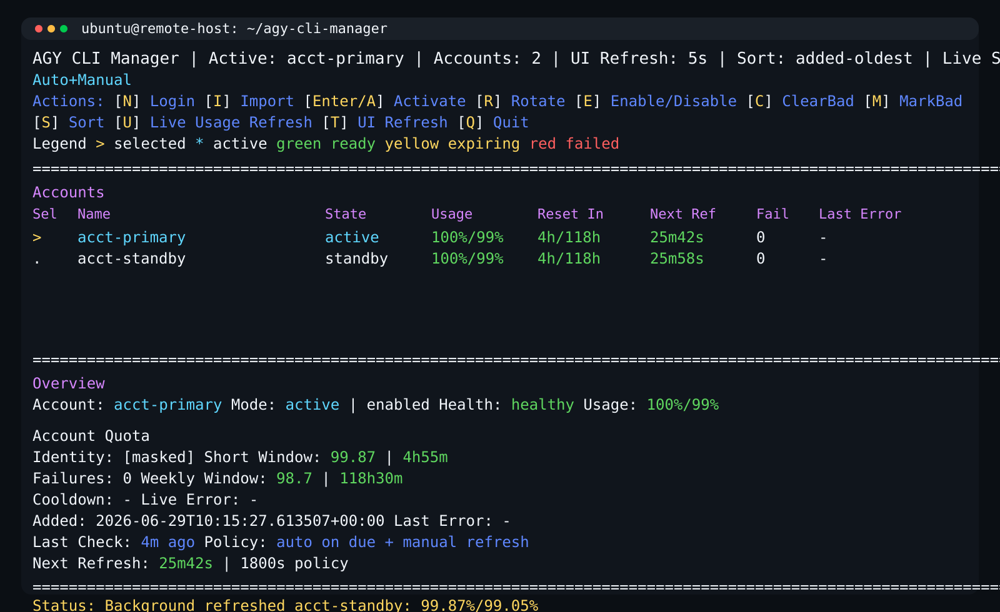
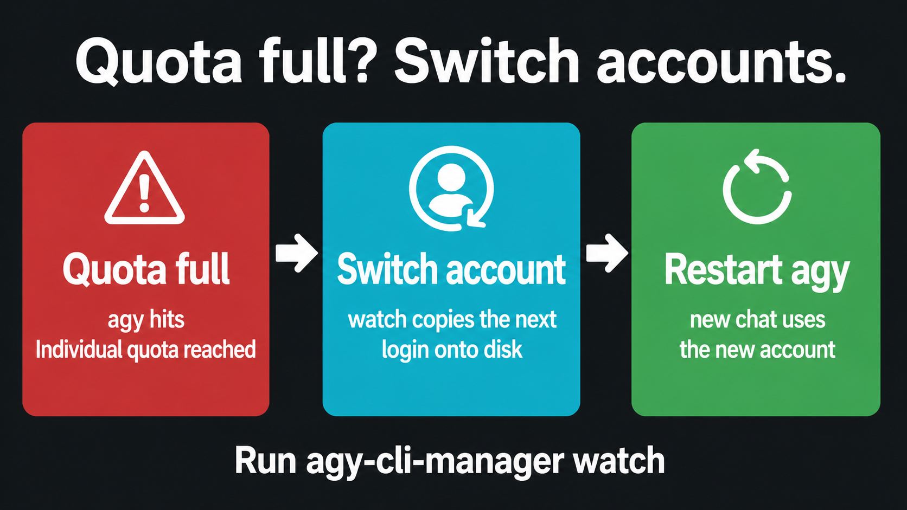

# agy-cli-manager

`agy-cli-manager` is a Python account manager for Antigravity CLI (`agy`) with active-standby failover, quota-aware switching, and machine-readable automation APIs.

It helps you run multiple Antigravity CLI accounts more safely by:

- switching away from low-quota or failed accounts
- watching live Antigravity CLI logs for `Individual quota reached` and failing over automatically
- keeping a managed runtime profile in sync with the active account
- exposing CLI and Python APIs for bots, schedulers, and external apps
- supporting manual or automatic account rotation policies

Keywords:
Antigravity CLI account manager, Antigravity CLI multi account manager, Antigravity multi account auth, Antigravity login manager, Antigravity auth manager, Antigravity account switcher, agy multi account manager, agy multi account auth, agy login manager, agy auth manager, agy failover, agy quota switching, Gemini CLI multi account auth, Gemini CLI account rotation.

It is designed for one active account at a time:

- keep multiple saved `agy` profiles
- switch the active profile explicitly or after failure
- expose machine-readable state for external callers
- stay usable as a CLI app, TUI dashboard, or Python library

It is application-agnostic. A Telegram bot can call it, but the manager itself is not Telegram-specific.



Project links:

- Repo: `https://github.com/zcop/agy-cli-manager`
- Release wheel: `https://github.com/zcop/agy-cli-manager/releases`
- GitHub Pages site: `https://zcop.github.io/agy-cli-manager/`

## What it does

- stores multiple account profiles safely
- keeps one account active while others stay standby/cooldown/disabled
- supports isolated interactive `agy` login
- can import an existing `~/.gemini` or similar live home
- supports both manual-only and automatic failover switching modes
- prefers fuller, healthier standby accounts when auto-switching
- tracks cached identity, health, and usage metadata
- tracks separate Gemini and Claude/GPT-OSS five-hour and weekly quota pools
- tracks live switch coordinator state for callers that need to wait on failover
- exposes CLI commands and JSON output for automation
- supports account failover with cooldowns and lock-protected state changes
- tails Antigravity CLI logs so a running `agy` TUI can trigger failover without a bot caller

## Requirements

- Python 3.10+
- a working `agy` binary available in `PATH`, or passed explicitly with `--agy-binary`
- a terminal if you want to use `login` or the full-screen dashboard

## Install

From a GitHub release wheel:

```bash
python3 -m venv .venv
. .venv/bin/activate
pip install https://github.com/zcop/agy-cli-manager/releases/download/v0.2.2/agy_cli_manager-0.2.2-py3-none-any.whl
```

To upgrade an existing installation to this release:

```bash
pip install --upgrade https://github.com/zcop/agy-cli-manager/releases/download/v0.2.2/agy_cli_manager-0.2.2-py3-none-any.whl
```

From this repo:

```bash
cd agy-cli-manager
python3 -m venv .venv
. .venv/bin/activate
pip install -e .
```

After that, you can use either:

```bash
agy-cli-manager --help
```

or:

```bash
PYTHONPATH=src python3 -m agy_cli_manager.cli --help
```

## Quick Start

### 1. Initialize the manager state

```bash
agy-cli-manager init
```

By default, state lives under:

```text
~/.agy-cli-manager
```

You can override that with `--root /path/to/root`.

### 2. Add your first account

If you already have a live Antigravity home:

```bash
agy-cli-manager import-current my-account ~/.gemini
```

If you want the manager to drive a fresh interactive login itself:

```bash
agy-cli-manager login my-account --agy-binary /path/to/agy
```

`login` will hand your terminal to a real `agy` session. Complete the normal Antigravity onboarding/login there, then exit `agy`. The manager will save the resulting profile snapshot.

### 3. Check what is active

```bash
agy-cli-manager status
agy-cli-manager current
agy-cli-manager list
```

### 4. Open the dashboard

```bash
agy-cli-manager
```

With no subcommand, the full-screen dashboard opens by default.

### 5. Auto-switch when quota is full

When `agy` hits **Individual quota reached**, the manager switches to the next account. Restart `agy` after that. The old process may keep writing quota errors; those lines do not rotate again until you acknowledge the restart or a new session log appears.



```bash
agy-cli-manager switch-mode auto
agy-cli-manager watch
```

After restarting `agy`:

```bash
agy-cli-manager ack-restart
```

Leave the dashboard open instead of `watch` if you prefer (`Y` acknowledges the restart). Do not pass `--from-start` unless you intend to replay old quota errors.

## First Useful Commands

```bash
agy-cli-manager status --json
agy-cli-manager credential-status --json
agy-cli-manager whoami
agy-cli-manager models --json
agy-cli-manager ensure-active --json
agy-cli-manager ensure-active --family gemini --json
agy-cli-manager ensure-active --family other --json
agy-cli-manager resolve-route --family gemini --json
agy-cli-manager switch-mode
agy-cli-manager switch-mode manual
agy-cli-manager switch-mode auto
agy-cli-manager switch-policy --json
agy-cli-manager switch-policy --short-threshold 10 --refresh-failure-threshold 2 --candidate-strategy balanced
agy-cli-manager switch-policy --gemini-threshold 10 --other-threshold 10
agy-cli-manager switch-policy --family-fallback-strategy same-family-first
agy-cli-manager refresh-usage --json
agy-cli-manager switch-next
agy-cli-manager rotate-after-failure --reason quota --cooldown-minutes 60 --json
agy-cli-manager watch
agy-cli-manager watch --once --json
agy-cli-manager ack-restart
```

### Linux Secret Service

Recent `agy` versions may use the Linux Secret Service item identified by
`service=gemini` and `username=antigravity` instead of, or ahead of, the token
file. Install your distribution's `secret-tool` package (for Debian/Ubuntu,
`libsecret-tools`) when using a desktop keyring:

```bash
agy-cli-manager credential-status --json
agy-cli-manager credential-backend auto
agy-cli-manager import-current account1 ~/.gemini
agy-cli-manager capture-active --json
```

`auto` selects Secret Service only when the helper, D-Bus session, and exact
Antigravity credential are present; SSH/server installations with no keyring
entry keep the file backend. Use `credential-backend secret-service` to require
the keyring or `credential-backend file` to opt out explicitly.

Saved accounts remain private `0600` JSON files. Switching writes and verifies
the live keyring credential before publishing the new active account, and rolls
back the keyring, live file, and runtime token on failure. Close a running `agy`
before switching or capturing because it keeps the old credential in memory.
Named model, usage, and warmup probes isolate D-Bus so the global keyring cannot
silently override the selected saved profile.

The current switch policy is stored in manager state and can be controlled by either:

- CLI: `switch-mode`, `switch-policy`, `ensure-active`
- Python API: `get_status_snapshot()`, `get_switch_policy()`, `update_switch_policy()`, `ensure_active_account()`

Directory layout:

```text
~/.agy-cli-manager/
├── accounts/
│   └── <account-name>/
│       └── .gemini/
│           └── ...
├── runtime/
│   └── .gemini/
└── state.json
```

Optional integration:

- `live_dir` can point at a real Antigravity/Gemini CLI home such as `~/.gemini`
- when set, switches sync the managed active profile into that live CLI home

Example:

```bash
agy-cli-manager set-live-dir ~/.gemini
agy-cli-manager apply-active
```

This is useful when another process launches `agy` and you want that live home to always reflect the currently active saved profile.

Commands:

```bash
agy-cli-manager
agy-cli-manager dashboard
agy-cli-manager menu
agy-cli-manager init
agy-cli-manager list
agy-cli-manager current
agy-cli-manager status
agy-cli-manager status --json
agy-cli-manager ensure-active
agy-cli-manager switch-mode
agy-cli-manager switch-mode manual
agy-cli-manager switch-mode auto
agy-cli-manager switch-policy
agy-cli-manager refresh-usage
agy-cli-manager refresh-usage account1 --json
agy-cli-manager refresh-due
agy-cli-manager refresh-due --json
agy-cli-manager models
agy-cli-manager models --json
agy-cli-manager models account1 --json
agy-cli-manager whoami
agy-cli-manager whoami account1 --refresh
agy-cli-manager whoami account1 --probe-usage --agy-binary /path/to/agy
agy-cli-manager add account1 /path/to/source
agy-cli-manager import-current account1
agy-cli-manager import-current account1 /path/to/.gemini
agy-cli-manager login
agy-cli-manager login account1 --agy-binary /path/to/agy
agy-cli-manager activate account1
agy-cli-manager switch account1
agy-cli-manager rotate
agy-cli-manager switch-next
agy-cli-manager disable account1
agy-cli-manager enable account1
agy-cli-manager mark-bad account1 --reason quota --cooldown-minutes 60
agy-cli-manager clear-bad account1
agy-cli-manager set-live-dir ~/.gemini
agy-cli-manager apply-active
agy-cli-manager switch-mode manual
agy-cli-manager rotate-after-failure --reason quota --cooldown-minutes 60 --json
agy-cli-manager rotate-after-failure --reason quota --cooldown-minutes 60 --force-switch --json
agy-cli-manager watch
agy-cli-manager watch --once --json
agy-cli-manager watch --no-rotate --once
agy-cli-manager update-meta account1 --usage-status known --usage-value 42 --reset-at 2026-07-01T00:00:00+00:00 --health-status healthy --last-live-check-at 2026-06-30T06:00:00+00:00 --next-live-check-at 2026-06-30T06:30:00+00:00 --refresh-policy-seconds 1800
agy-cli-manager update-meta account1 --short-usage-status known --short-usage-value 97.57 --short-reset-at 2026-07-01T00:00:00+00:00 --weekly-usage-status unknown
```

`add` accepts either:

- a directory that is already a `.gemini` profile root
- or a parent directory containing `.gemini/`

## JSON/API-oriented usage

For automation, prefer the JSON-capable commands:

```bash
agy-cli-manager status --json
agy-cli-manager current --json
agy-cli-manager list --json
agy-cli-manager ensure-active --json
agy-cli-manager ensure-active --family other --json
agy-cli-manager resolve-route --family gemini --fallback-strategy same-account-first --json
agy-cli-manager switch-policy --json
agy-cli-manager switch-policy --short-threshold 12.5 --refresh-failure-threshold 3 --candidate-strategy highest-short --json
agy-cli-manager refresh-usage account1 --json
agy-cli-manager refresh-due --json
agy-cli-manager models --json
agy-cli-manager rotate-after-failure --reason quota --family other --cooldown-minutes 60 --json
agy-cli-manager watch --once --json
```

Typical external-app flow:

1. read current state with `status --json`
2. call `ensure-active --family gemini|other --json` before sending real work so the manager evaluates the quota pool the selected model will use
3. read `switch_mode` and `switch_policy` to decide how aggressively your caller should auto-fail over
4. use `models --json` if the caller needs model choices for the active account
5. call `refresh-usage --json` or `refresh-due --json` only when needed
6. if a real request fails due to quota, call `rotate-after-failure --family gemini|other --json`; omit the family only when it is genuinely unknown
7. inspect `switch_runtime` or wait briefly until it leaves `switching`
8. retry the real request once on the new active account
9. persist caller-side observations back with `update-meta`

For a chatbox/load-balancer caller, `resolve-route` implements the family/account matrix and returns `selected_family` plus the active account:

- `same-family-first` (default): current account/preferred family, another account/preferred family, current account/other family, then another account/other family
- `same-account-first`: current account/preferred family, current account/other family, another account/preferred family, then another account/other family
- `strict-family`: never cross to the other model family

The manager applies an allowed account switch. It does not select a concrete model inside `agy`; the caller uses `selected_family` to choose the model. In manual switch mode, a route that needs another account returns `outcome=switch_required` and `recommended_account` unless `--force-switch` is supplied.

Notes:

- running `agy-cli-manager` with no subcommand opens the full-screen dashboard
- `dashboard` is a TTY-only full-screen view with a fast local-only UI refresh and manual account actions
- `list`, `current`, `activate`, and `rotate` are convenience commands for standalone use; they map to the same manager state as the lower-level commands.
- local operator notes such as `AGENTS.md` are intentionally kept untracked and are not part of the public repo contract.
- `agy-cli-manager login` prompts for the account name if you do not pass one
- `switch-next` skips accounts in cooldown.
- `mark-bad` clears the active pointer if that account was active.
- `ensure-active --family gemini|other` evaluates the requested model family's five-hour and weekly quota and can recover from no active account, known low quota, auth missing, or repeated refresh failures. Omitting `--family` preserves the legacy Gemini-oriented behavior.
- `ensure-active` returns JSON with `switch_runtime`, so callers can see whether the manager is idle, switching, ready, or has no standby account available.
- `switch-mode` controls whether `rotate-after-failure` automatically moves to the next eligible standby account or stops after marking the active account bad.
- `switch-policy` controls per-family proactive short-window thresholds, refresh-failure threshold, and standby candidate ranking strategy. `--short-threshold` sets both families; `--gemini-threshold` and `--other-threshold` override them independently.
- `family_fallback_strategy` controls whether routing preserves the requested family, preserves the current account, or forbids cross-family fallback.
- state and switching are protected by a single lock file so a caller can safely trigger failover from another process.
- `set-live-dir` lets the manager drive a real CLI home in addition to its own internal `runtime/`.
- the manager currently copies the managed profile under `.gemini/`, centered on the Antigravity auth/token artifacts it needs for switching.
- it supports Antigravity-style `antigravity-cli/antigravity-oauth-token` auth storage and related identity extraction.
- `login` hands the terminal directly to a real `agy` session in the configured runtime home; complete onboarding/login there, exit `agy`, and the manager then saves the captured profile snapshot.
- `login` stores the profile under the detected account name when available, not just the typed label.
- if that detected account already exists, `login` warns and asks whether to overwrite the saved profile.
- `whoami` reports the detected signed-in account name from profile metadata, and `--probe-usage` can additionally run `agy -p /usage` against that profile as a live check.
- `models` runs `agy models` for the active account or a named saved profile and can return structured JSON for external callers.
- the manager intentionally does not use scripted PTY startup probing for `agy`; profile switching is filesystem-based. Runtime health still comes from real request success/failure, including Antigravity CLI log lines.
- `watch` tails `live_dir/antigravity-cli/log/` (and `cli.log`) for `RESOURCE_EXHAUSTED (code 429): Individual quota reached` and weekly quota lines. It starts at end-of-file so historical quota errors are not replayed.
- in `auto` mode, `watch` and the dashboard log poll call `rotate-after-failure` with `trigger=log-watch`. In `manual` mode they report the error and leave the active account in place unless `--force-switch` is set.
- a switched profile is on disk (and in the live CLI home) immediately; a running `agy` process must be restarted to pick up the new token.
- in `auto` mode, `ensure-active --family ...` can proactively switch away when either that family's cached five-hour or weekly window falls to its configured threshold. A family-specific quota failure records only a `family_cooldowns` entry; it does not globally cool down an account whose other model family remains usable.
- cached quota is advisory; real runtime failure is still the final authority for callers such as bots.
- when auto-switching for a requested family, the manager rejects candidates known to be depleted in that family, then ranks the remaining pool by health and that family's remaining quota. Unknown quota stays eligible but ranks behind known usable quota.
- the default switch policy uses a 10% threshold for both families, `refresh_failure_threshold=2`, and `candidate_strategy=balanced`.
- `rotate-after-failure` is the public failover operation for external apps: mark the current active account bad, optionally put it in cooldown, then switch to the next eligible standby account.
- `rotate-after-failure` is idempotent across a short dedupe window and reports an `outcome` such as `switched`, `already_switched`, or `no_candidate`.
- `switch_runtime` is persisted in state so a caller can coordinate retry logic without racing another caller into a second switch.
- `rotate-after-failure` follows the persisted switch mode by default: `auto` attempts failover, `manual` leaves the manager inactive until an operator or caller explicitly switches accounts. Use `--force-switch` to override that for one run.
- `update-meta` lets an external app persist cached runtime metadata such as usage, reset time, health, last check, and next refresh time.
- `refresh-due` is the non-interactive refresh entrypoint for cron/systemd/external callers; it refreshes the active account first when due, otherwise the first due eligible standby account.
- usage metadata is stored under `usage_windows.short` and `usage_windows.weekly`; the old flat `usage_*` and `reset_at` fields remain as compatibility aliases for the short window.
- dashboard keybindings: `Up/Down` or `j/k` move, `n` login, `i` import, `Enter` or `a` activate, `r` rotate, `w` toggle switch mode (`auto`/`manual`), `e` enable/disable, `c` clear bad, `m` mark bad, `s` cycle sort (`added`, `usage`, `countdown`), `u` local refresh, `t` cycle UI refresh (`5s/10s/15s/30s`), `q` quit.
- dashboard overview now shows both account quota state and switch coordinator state.
- while the dashboard is open it also tails live Antigravity CLI logs every second and can fail over in `auto` mode. The header shows `LogWatch: restart agy` until you restart `agy` after a log-triggered switch.

Cached runtime metadata:

- usage/reset/health data is persisted in manager state
- the dashboard list currently uses the short window for its usage and countdown columns
- the selected-account panel shows five-hour and weekly quota for both Gemini and Claude/GPT-OSS model families
- on relaunch, the dashboard reuses cached metadata immediately
- countdowns and freshness are recalculated locally from saved timestamps
- external apps should update this metadata after real checks or real requests
- fast dashboard refresh does not itself perform live checks

Python usage:

```python
from pathlib import Path

from agy_cli_manager import (
    build_paths,
    get_status_snapshot,
    get_switch_policy,
    list_models,
    poll_quota_logs,
    rotate_after_failure,
    update_switch_policy,
)

paths = build_paths(Path.home() / ".agy-cli-manager")
snapshot = get_status_snapshot(paths)
policy = get_switch_policy(paths)
update_switch_policy(paths, short_usage_threshold_percent=12.5, candidate_strategy="highest-short")
models = list_models(paths)
result = rotate_after_failure(paths, reason="quota", cooldown_minutes=60)
print(snapshot["active"], "->", result.switched_to)
print(policy)
print([model["name"] for model in models["models"]])
```

Public Python API:

- `build_paths(root)`
- `ensure_layout(paths)`
- `get_status_snapshot(paths)`
- `get_credential_status(paths)`
- `set_credential_backend(paths, backend)`
- `capture_active_credential(paths)`
- `get_switch_policy(paths)`
- `update_switch_policy(paths, ...)`
- `ensure_active_account(paths, force=False, required_family=None)`
- `resolve_route(paths, preferred_family, fallback_strategy=None, force_switch=False)`
- `list_models(paths, name=None, ...)`
- `refresh_account_usage(paths, name=None, ...)`
- `refresh_due_account(paths, ...)`
- `switch_account(paths, name)`
- `switch_next(paths)`
- `rotate_after_failure(paths, reason, cooldown_minutes=60, live_dir=None, force_switch=False, required_family=None)`
- `poll_quota_logs(paths, ...)`
- `watch_quota_logs(paths, ...)`
- `parse_quota_log_line(line)`
- `set_switch_mode(paths, mode)`
- `set_live_dir(paths, live_dir)`
- `update_account_runtime_metadata(paths, name, ...)`

Important returned state:

- `get_status_snapshot(paths)` includes `switch_runtime` and `log_watch`
- `ensure_active_account(...)` reports the active account decision
- `rotate_after_failure(...)` returns a `RotationResult` with `outcome`

`switch_runtime` has these practical states:

- `idle`: no failover is happening
- `switching`: a caller has started coordinated failover
- `ready`: failover finished and an active account is set
- `no_account`: failover finished but no eligible standby account was available

More explicit example:

```python
from pathlib import Path

from agy_cli_manager import build_paths, ensure_layout, list_models

paths = build_paths(Path.home() / ".agy-cli-manager")
ensure_layout(paths)

payload = list_models(paths)
for model in payload["models"]:
    print(model["name"], model["variant"])
```
